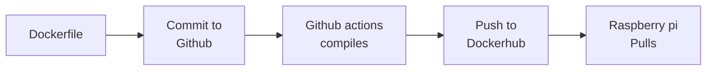

## Basic schematic
Basic schematic of the docker workflow:

```mermaid
graph LR;
Dockerfile-->push[Commit to\nGithub];
push-->GA[Github actions\ncompiles];
GA-->DH[Push to\nDockerhub];
DH-->PI[Raspberry pi\nPulls];
```

